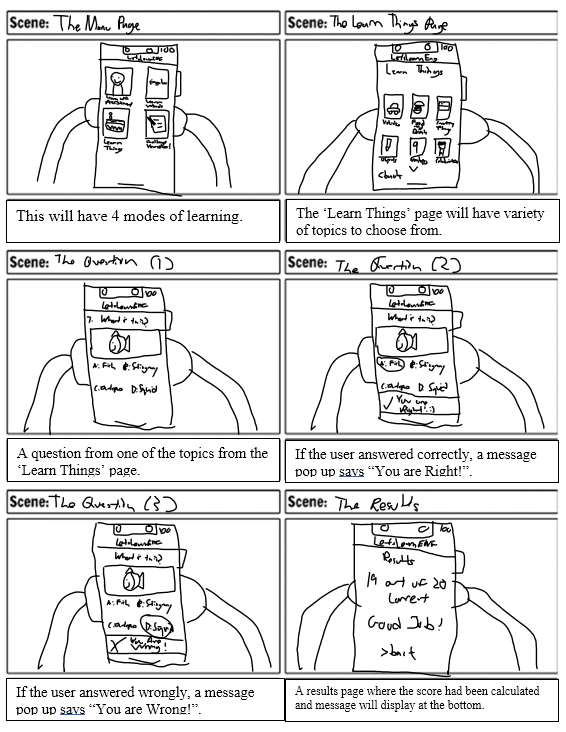
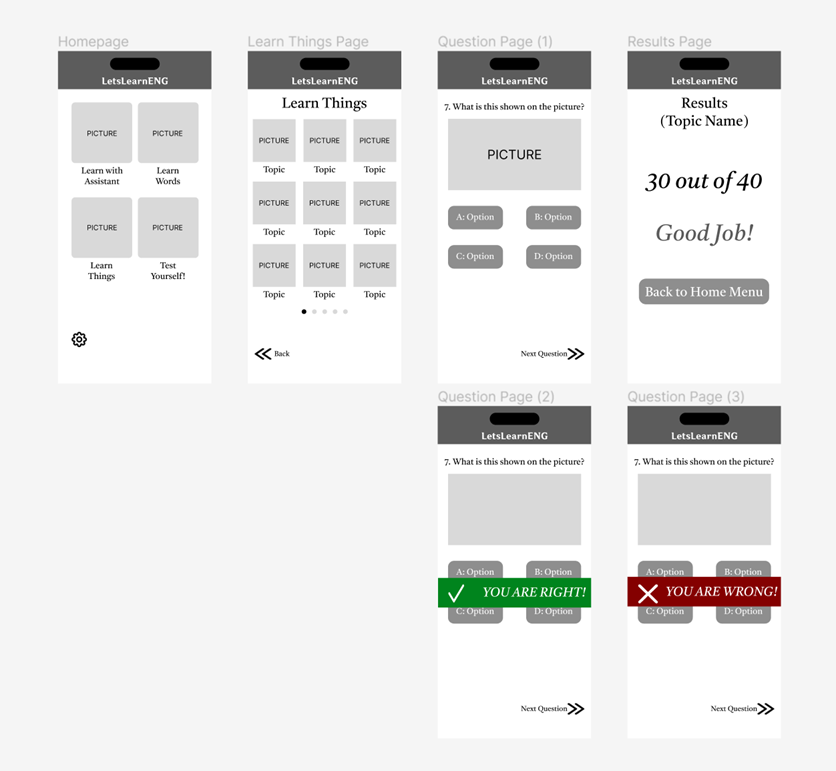
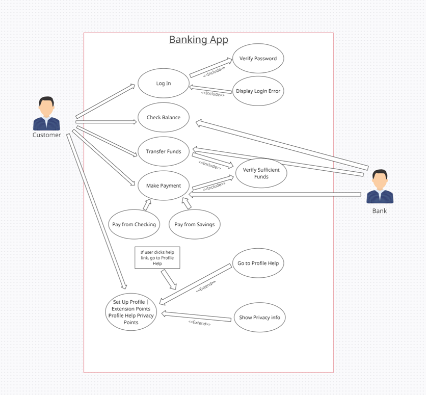
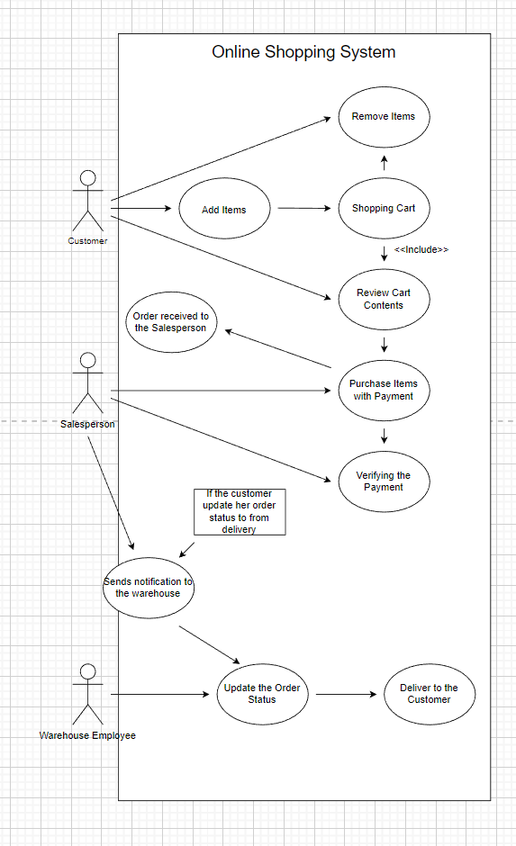

# Software Development Practices
### This is a collection of my Software Development Practices coursework where I learn about different software development life cycles, identify user needs, perform storyboarding, develop wireframes and UI/UX prototypes and draw UML diagrams for specific scenarios.

    
    

## Technologies Used
* **Adobe Photoshop**: Used to perform storyboarding, coming up with wireframes and designing UI/UX prototypes
* **draw.io**: Used to draw UML diagrams 

## Some snapshots of my learning process
### Comparing software development lifecycle to building a house
<table>
  <tr>
    <th>SDLC Phases</th>
    <th>Requirement Development Activities (Building a House)</th>
  </tr>
  <tr>
    <td>Analysis Phase 
        <li>Business Requirements (Surveys, Interviews, Use Cases)</li>
        <li>Functional Requirements</li>
        <li>Non-Functional Requirements</li>
    </td>
    <td>Analysis Phase
        <li>Occupants > Rooms, sizes of rooms</li>
        <li>Type of building</li>
        <li>Style</li>
        <li>Engineering Requirements</li>
    </td>
  </tr>
  <tr>
    <td>
 Design Phase
        <li>UI UX design</li>
        <li>System design</li>
        <li>Database design</li>
        <li>Software specs</li>
    </td>
    <td>
 Design Phase
        <li>House plan/Blueprint</li>
        <li>Parts/Items required</li>
        <li>Engineering Plans</li>
        <li>Schedules/Timeline</li>
    </td>
  </tr>
  <tr>
    <td>
 Implementation/Development Phase
        <li>Code/develop the software</li>
    </td>
    <td>
 Implementation/Development Phase
        <li>Build the house according to the plans</li>
    </td>
  </tr>
    <tr>
    <td>
 Testing Phase
        <li>Unit Testing</li>
        <li>Integration Testing</li>
        <li>System Testing</li>
        <li>Acceptance Testing</li>
    </td>
    <td>
 Testing Phase
        <li>Electrical test</li>
        <li>Water system test / Plumbing test</li>
        <li>Heat system / Aircon test</li>
        <li>Appliances test (oven, water heater)</li>
    </td>
  </tr>
  <tr>
    <td>
 Documentation Phase
        <li>Technical documents</li>
        <li>User Guide (documents)</li>
    </td>
    <td>
 Documentation Phase
        <li>SLA, ministries approval documents</li>
        <li>Buyer/seller</li>
        <li>Contract documents</li>
        <li>Appliances instructions documents</li>
    </td>
  </tr>
  <tr>
    <td>
 Implementation/Execution Phase
        <li>Launch the system/app</li>
        <li>Hand over the</li>
        <li>Handover the system to stakeholder</li>
        <li>Training</li>
    </td>
    <td>
 Implementation/Execution Phase
        <li>Launch the project</li>
        <li>Sign the sales contract</li>
        <li>Hand over documentation and keys to the buyers</li>
    </td>
  </tr>
  <tr>
    <td>
 Maintenance Phase
        <li>Monitor the system</li>
        <li>Bug fixing etc</li>
    </td>
    <td>
 Maintenance Phase
        <li>Monitor the property (HDB or MCST)</li>
        <li>Fix all problems</li>
        <li>Fix wear & tear</li>
    </td>
  </tr>
</table>

### Comparing different software development models like AGILE and DevOps
<table>
  <tr>
    <th></th>
    <th>AGILE</th>
    <th>DevOps</th>
  </tr>
  <tr>
    <td>Benefits</td>
    <td>For first time beginners. Agile is easy to manage while exploring.

Agile enables concurrent development and delivery within an overall context.
</td>
    <td>It recommends you a more stable and open operation environment.

It gives you the opportunity to use up the time to innovate other than fixing bugs.
</td>
  </tr>
  <tr>
    <td>Drawbacks</td>
    <td>Agile model depends heavily on customer interaction. Making a mistake will cause the team to give them the wrong idea

Agile lacks predictability.
</td>
    <td>In order to develop with DevOps, you need a lot of money to pay which is too expensive.

DevOps professionals or expert’s developers can’t be available all the time.
</td>
  </tr>
</table>

### Create storyboards to design the UX/UI of the application and visualize the navigation wireframe and app layout

### Drawing UML diagrams to visualize use case scenarios

   
  <h1 align="center">Hi There! I'm Joshua! &#128075;</h1>
    

      
  

  
Thank you for taking the time to look through my project! I hope you enjoyed it as much as I did during the development of this project!

  
Feel free to contact me to discuss any issues, questions or comments.

